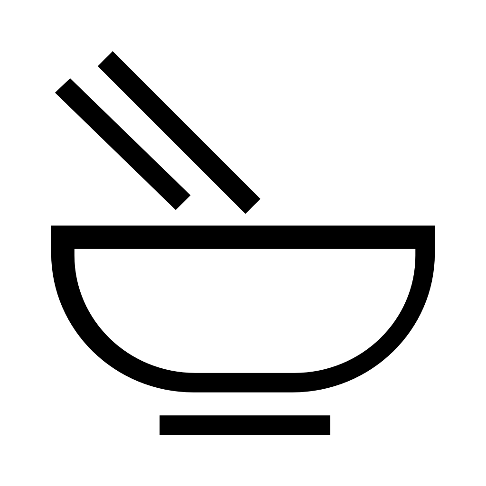
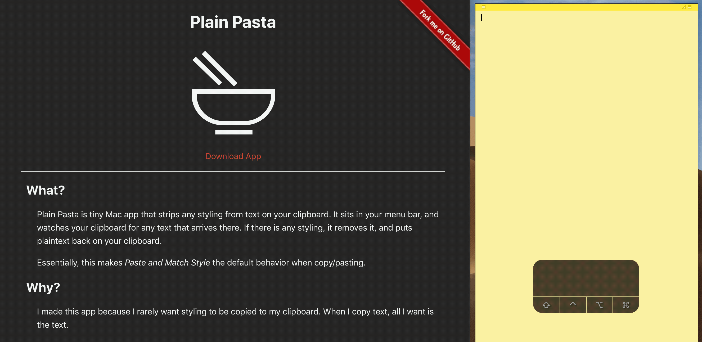
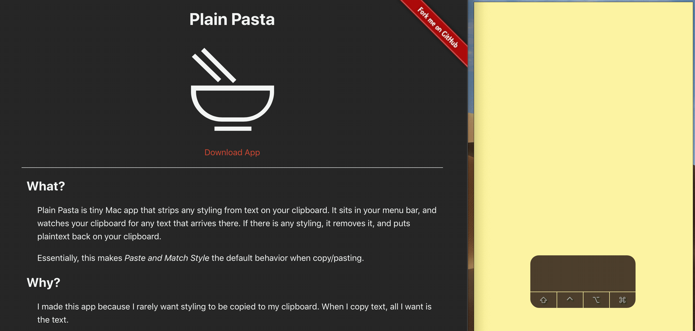

# Plain Pasta

Plain Pasta is a tiny Mac app that makes "Paste and Match Style" the default copy/paste behavior.

It sits in your menu bar, and watches your clipboard for text, removes any styling from the text, and puts plaintext back on your clipboard.

I made this app because I rarely want styling to be copied to my clipboard. When I copy text, all I want is the text.

Download the most recent version of Plain Pasta from the [Releases page](https://github.com/hisaac/PlainPasta/releases).

### Demonstration

#### Without Plain Pasta

<figure>
	
	<figcaption>
Copy/Pasting styled text takes both the text <em>and</em> the styling with it
</figcaption>
</figure>

#### With Plain Pasta

<figure>
	
	<figcaption>
Copy/Pasting styled text <em>with</em> Plain Pasta enabled only pastes the text itself, no styling
</figcaption>
</figure>

## Attribution

Plain Pasta was inspired by another app called [FormatMatch](https://itunes.apple.com/us/app/formatmatch/id445211988?mt=12) by [Robert Wessels](http://www.robertwessels.com).

I've used FormatMatch for many years, and I would've happily used it for many more years to come, but the app hasn't been updated for over 6 years, and Robert Wessel's website hasn't been updated since 2016. I've been concerned for the continued life of the app, so I finally decided to take the time to write a new version using modern technologies.

- Icon image is [Noodles by Paolo Valzania from the Noun Project](https://thenounproject.com/search/?q=noodle&i=1681744)
- Clipboard monitoring code based on [klipsustreamer](https://github.com/lahdekorpi/klipsustreamer) by [Toni Lähdekorpi](https://github.com/lahdekorpi)

<!--
- [ ] Let this guy know I released the app: <https://twitter.com/hisaac/status/775131593878888452>
- [ ] Add to [Open Source Mac Apps](https://github.com/serhii-londar/open-source-mac-os-apps)
- [ ] Add to homebrew cask
- [ ] Integrate Sparkle for updates
- [ ] Distribute through Mac App Store?
-->
